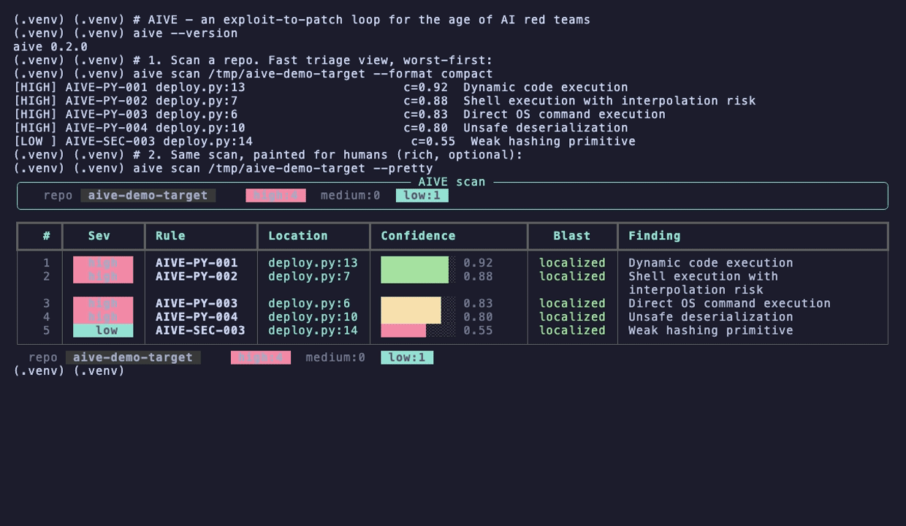
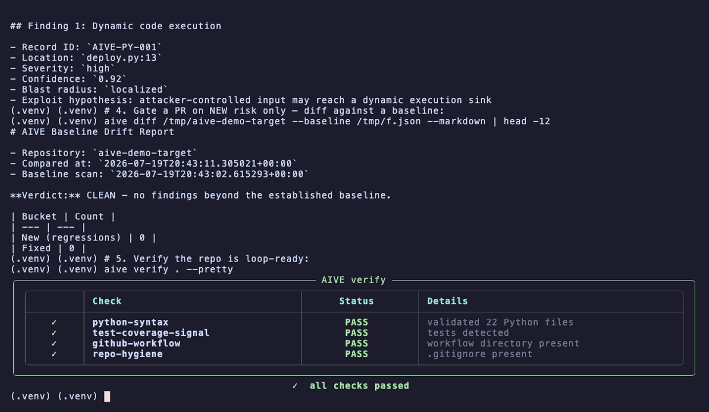

# AIVE — AI-Validated Exploit

[](https://github.com/waleedsworld/aive-protocol/actions/workflows/aive-dry-run.yml)
[](LICENSE)
[](https://www.python.org/downloads/)
[](pyproject.toml)
[](#roadmap)
[](CONTRIBUTING.md)

**An exploit-to-patch loop for repositories that are increasingly run by AI, for AI, and against AI.**

AIVE is a small, GitHub-first prototype with a big thesis: as coding agents get stronger, "finding bugs" stops being the hard part. The hard part becomes *proving a bug is real, estimating how far it can spread, drafting safe patches, verifying them, and shipping the fix* — all without letting an autonomous system quietly break production while you were at lunch.

The threat model is shifting too. The red team of the future isn't one human filing a bug report; it's offensive automation roaming the internet, chaining weaknesses at machine speed. If that becomes normal, the blue team needs the same reach: systems that can investigate, reproduce, patch, verify, and harden code *before* hostile agents show up. AIVE is a minimal skeleton for that blue-team loop — think of it as a tiny, opinionated CVE pipeline you can run on your own repo before breakfast.

> **TL;DR** — point it at a repo, it flags risky patterns, drafts an exploit-to-patch plan for each one, and runs verification checks. No servers, no accounts, no telemetry. Just Python and good intentions.

<p align="center">
  
</p>

<p align="center">
  <em>One command. Scan → paint → plan → gate-on-new-risk → verify.</em><br>
  <strong>Live demo:</strong> deploying soon.
</p>

---

## What's new in 0.2 — the loop grew teeth

AIVE started as a scanner with a thesis. This release turns it into a workflow you'd actually wire into CI:

| ✦ New | What you get |
| --- | --- |
| **`aive diff` — baseline drift gating** | Block a PR only when it introduces *new* risk, not for debt it inherited. Findings match on a line-agnostic fingerprint, so refactors don't cry wolf. |
| **Rich terminal UI (`--pretty`, `aive tui`)** | Colour-graded severity tables, confidence meters, a live scan progress bar, and a full interactive menu — all opt-in, zero-dep core untouched. |
| **Output variants (`--format plain\|compact\|json`)** | JSON for machines, `compact` for `grep`-fast triage, `plain` for reading a scan by eye. Every flag composes with the gate. |
| **Bomb-proof CLI** | Clean errors instead of tracebacks, `NO_COLOR` / `--no-color`, survives `| head` and Ctrl-C, validates paths and confidence bounds. |
| **A real test suite + CI** | 120+ tests across engine, CLI, and an end-to-end pipeline, wired to GitHub Actions. |
| **Faster, safer scans** | Ignored trees pruned, oversized files guarded, findings streamed. |
| **Packaging & docs** | One-line `pipx` install, PyPI/Homebrew metadata, `py.typed`, CHANGELOG + CONTRIBUTING. |

<p align="center">
  
</p>

---

## Install in one line

The fastest path is [`pipx`](https://pipx.pypa.io) — it drops the `aive` command on your PATH in its own isolated environment, no venv juggling:

```bash
pipx install git+https://github.com/waleedsworld/aive-protocol.git
```

No pipx? Plain `pip` works too:

```bash
pip install git+https://github.com/waleedsworld/aive-protocol.git
```

Either way you get the `aive` command. Confirm it:

```bash
aive --version   # -> aive 0.2.0
```

Want to hack on the rules instead? Jump to [Quick start](#quick-start-beginner-friendly-nothing-assumed) for the editable-install workflow.

> **Maintainers:** a ready-to-tap Homebrew formula template lives at
> [`packaging/homebrew/aive.rb`](packaging/homebrew/aive.rb) — fill in the release
> tarball checksum after cutting a tag to offer `brew install`.

---

## The core loop

1. **Scan** a repository for high-risk patterns.
2. **Validate** whether the issue actually looks exploitable (not just "the regex matched").
3. **Estimate blast radius** — localized, moderate, or broad.
4. **Draft multiple safe patch options** per finding.
5. **Verify** — syntax, test presence, workflow hygiene.
6. **Hand off** to GitHub for review, PRs, and independent verifier agents.

`main` stays human-owned and reviewable. AI runs in a constrained maintenance lane. One agent proposes; separate verifier agents reproduce and cross-check; only validated fixes with passing checks get promoted toward merge.

---

## What's in the box

- **A pattern scanner** with 8 rules covering the classics — dynamic `eval`/`exec`, shelling out with `shell=True`, raw `os.system`, unsafe `pickle`/`yaml.load`, hard-coded credentials, disabled TLS verification, and weak hashing.
- **Confidence + severity + blast-radius scoring** on every finding, sorted worst-first.
- **Inline suppression** — annotate a reviewed false positive with `# aive: ignore` and the loop stops re-flagging it. (The scanner even passes a clean scan of itself this way.)
- **Patch-plan generation** — each finding comes with a rule-specific remediation plus a standard "reproduce first, ship behind a branch, verify independently" gate.
- **Verification checks** — Python syntax, test-coverage signal, workflow presence, repo hygiene.
- **CI gating** — `--fail-on high` turns the scan into a merge blocker; `--min-confidence` tunes the noise floor.
- **A GitHub Actions dry-run** you can schedule or trigger by hand.

Zero third-party runtime dependencies. The whole thing is the standard library and a clear conscience.

---

## Quick start (beginner-friendly, nothing assumed)

**Prerequisites:** Python 3.11 or newer. Check with:

```bash
python3 --version
```

**1. Clone it:**

```bash
git clone https://github.com/waleedsworld/aive-protocol.git
cd aive-protocol
```

**2. Make a cozy little virtual environment** (keeps your global Python tidy):

```bash
python3 -m venv .venv
source .venv/bin/activate        # Windows: .venv\Scripts\activate
```

**3. Install it** (editable, so you can hack on the rules):

```bash
pip install -e .
```

That's it — you now have an `aive` command on your PATH. Kick the tires:

```bash
aive --version
```

---

## Using it

AIVE ships one friendly command with four subcommands (`scan`, `plan`, `verify`, `diff`). Point it at any repo.

**Scan a repo and print JSON findings:**

```bash
aive scan .
```

**Save findings, then turn them into a patch plan:**

```bash
aive scan . --output artifacts/findings.json
aive plan artifacts/findings.json --output artifacts/patch-plan.md
```

**Run the verification checks:**

```bash
aive verify . --strict
```

**Gate a pull request in CI** (exit non-zero if anything high-severity shows up):

```bash
aive scan . --fail-on high
```

**Turn down the noise** with a confidence floor:

```bash
aive scan . --min-confidence 0.8
```

> Prefer plain scripts? The originals still live in `scripts/` (`scan_repo.py`, `patch_plan.py`, `verify_repo.py`) — that's what the CI workflow calls, so it needs no install step.

### Choosing an output format

`aive scan` speaks JSON by default (best for pipelines and `aive plan`), but two human-facing variants are one flag away with `--format`:

| `--format` | Shape | Use it for |
| --- | --- | --- |
| `json` *(default)* | The canonical `aive.scan.v1` payload — byte-for-byte unchanged. | Piping into `aive plan`, CI, tooling. |
| `compact` | One dense line per finding: `[SEV] rule  file:line  c=conf  title`. | Fast triage, `grep`/`awk`, PR comments. |
| `plain` | A verbose report grouped by severity with location, confidence, blast radius, hypothesis, and snippet. | Reading a scan by eye in a terminal. |

```bash
aive scan .                     # machine JSON (default, unchanged)
aive scan . --format compact    # one line per finding
aive scan . --format plain      # grouped, human-readable report
```

The format only reshapes the display — `--min-confidence`, `--fail-on`, and `--output` all compose with every variant, so `aive scan . --format compact --fail-on high` stays a valid merge gate.

```text
$ aive scan . --format compact --min-confidence 0.8
[HIGH] AIVE-PY-001 deploy.py:7                       c=0.92  Dynamic code execution
[HIGH] AIVE-PY-003 deploy.py:9                       c=0.83  Direct OS command execution
```

### A prettier terminal (optional)

The core commands stay plain-text and machine-friendly by default. For humans at
the keyboard there's an optional [`rich`](https://github.com/Textualize/rich)
front-end — colour-graded severity tables, confidence meters, a scan progress
bar, and a full interactive menu:

```bash
pip install -e ".[ui]"     # pulls in rich (still optional; core stays zero-dep)

aive scan .   --pretty      # coloured findings table + live progress bar
aive verify . --pretty      # green/amber/red status board
aive tui                    # interactive menu: scan, verify, plan, quit
```

If `rich` isn't installed, `--pretty` and `aive tui` quietly fall back to plain
output — nothing breaks, you just lose the paint. JSON output (`aive scan .`,
`--output`, `--json`) is never colourised, so pipelines and CI gating are
unaffected.

<p align="center">
  
</p>

### Gate a pull request on *new* risk only

`--fail-on high` is a blunt instrument: it blocks a PR whenever any high-severity pattern exists anywhere in the repo, including debt that predates the change. That trains reviewers to override the gate. `aive diff` fixes this by comparing the working tree against a **baseline** — typically the last known-good scan of `main` — and blocking only when the change in front of you *introduces* something new.

```bash
# 1. Record a baseline once (e.g. on main, cached in CI).
aive scan . --output baseline.json

# 2. On every PR, re-scan and compare. Exit non-zero only if the PR adds risk.
aive diff . --baseline baseline.json --fail-on-new

# Human-readable drift report for the PR body:
aive diff . --baseline baseline.json --markdown --output drift.md
```

Findings are matched by a **line-agnostic fingerprint** (`rule_id` + file + whitespace-normalized snippet), so moving a function, adding an import, or reindenting a block does not masquerade as a regression — only genuinely new occurrences count. The diff sorts findings into three buckets: **new** (regressions the PR added), **fixed** (progress), and **unchanged** (existing debt). Already have two saved scans? Skip the rescan with `--current current.json`.

The JSON report uses the `aive.diff.v1` schema:

```json
{
  "schema": "aive.diff.v1",
  "repo": "demo",
  "summary": { "new": 1, "fixed": 0, "unchanged": 4, "baseline_total": 4, "current_total": 5 },
  "new": [ { "rule_id": "AIVE-PY-003", "file_path": "deploy.py", "line": 12, "severity": "high" } ],
  "fixed": [],
  "unchanged": [ /* ... */ ]
}
```
### Suppressing a reviewed false positive

Sometimes a pattern is intentional (a rule definition, a test fixture, a checksum that isn't security-sensitive). Tag the line and AIVE will leave it be:

```python
digest = hashlib.md5(payload)  # aive: ignore  (checksum only, not a security control)
```

---

## What the output looks like

A scan payload is compact, sorted worst-first, and machine-friendly:

```json
{
  "schema": "aive.scan.v1",
  "repo": "demo",
  "finding_count": 3,
  "severity_summary": { "high": 2, "medium": 0, "low": 1 },
  "findings": [
    {
      "rule_id": "AIVE-PY-003",
      "title": "Direct OS command execution",
      "file_path": "deploy.py",
      "line": 7,
      "severity": "high",
      "confidence": 0.83,
      "blast_radius": "localized",
      "exploit_hypothesis": "a raw OS command call can be steered by unsanitised input"
    }
  ]
}
```

Feed that into `aive plan` and every finding gets a decision frame, a rule-specific fix, and a merge gate. A full rendered example lives in **[docs/sample-patch-plan.md](docs/sample-patch-plan.md)**.

---

## The rule set

| Rule ID | Severity | What it catches |
| --- | --- | --- |
| `AIVE-PY-001` | high | Dynamic code execution (`eval` / `exec`) |
| `AIVE-PY-002` | high | Shell execution with `shell=True` interpolation |
| `AIVE-PY-003` | high | Direct OS command execution (`os.system` / `os.popen`) |
| `AIVE-PY-004` | high | Unsafe deserialization (`pickle.loads`) |
| `AIVE-PY-005` | medium | `yaml.load` without a safe loader |
| `AIVE-SEC-001` | medium | Hard-coded credential markers |
| `AIVE-SEC-002` | medium | TLS verification disabled (`verify=False`) |
| `AIVE-SEC-003` | low | Weak hashing primitives (`md5` / `sha1`) |

Adding a rule is a two-line affair: drop a pattern into `RULES` in `aive/engine.py` and a preferred fix into `SPECIFIC_PATCH_OPTIONS`. They sit right next to each other on purpose.

---

## Repo layout

```text
.
├── .github/workflows/
│   ├── aive-dry-run.yml   # scheduled/manual scan dry-run
│   └── ci.yml             # pytest matrix on every push
├── aive/
│   ├── cli.py        # the `aive` command (scan / plan / verify / diff / tui)
│   ├── engine.py     # rules, scanning, patch planning, verification
│   ├── diff.py       # baseline drift detection (new / fixed / unchanged)
│   ├── render.py     # scan output variants (json / plain / compact)
│   ├── ui.py         # optional rich TUI, tables, progress bars
│   ├── _terminal.py  # colour/TTY handling for the plain CLI
│   └── __main__.py   # `python -m aive`
├── docs/
│   ├── media/        # demo.gif + screenshots
│   └── sample-patch-plan.md
├── examples/
│   └── aive-2026-0001.json   # what a finished advisory record looks like
├── packaging/homebrew/aive.rb
├── scripts/          # standalone entry points (used by CI)
├── tests/            # pytest suite
├── CHANGELOG.md
├── CONTRIBUTING.md
├── LICENSE
├── pyproject.toml
└── README.md
```

---

## Running the tests

The suite runs on `pytest`. Grab the dev extra and go:

```bash
pip install -e ".[dev]"
pytest -q          # 120+ tests: engine, CLI, diff, render, UI, e2e pipeline
```

The same suite runs on every push via [`.github/workflows/ci.yml`](.github/workflows/ci.yml).

---

## Advisory records

Findings that survive triage become **AIVE records** — reproduced, scoped, and paired with at least one safe patch path. Suggested naming: `AIVE-2026-0001`, `AIVE-2026-0002`, … See [examples/aive-2026-0001.json](examples/aive-2026-0001.json) for the shape.

---

## Roadmap

- GitHub App mode for PR orchestration.
- Sandbox execution for AI-generated patches.
- Multi-agent verifier quorum before merge.
- Regression replay against historical failures.
- Blast-radius scoring tied to dependency and ownership graphs.
- Language coverage beyond Python (the scanner already reads JS/TS/shell/YAML files).

---

## Positioning

This is **not** "AI bug-finding." It's exploit-to-patch infrastructure for the moment when humans can no longer line-by-line review large volumes of agent-generated code but still need software that compiles, behaves, and ships safely.

The north star is simple: keep it running for as long as software exists, continuously nudging systems toward a safer state — before red-team automation gets there first.

## License

MIT — see [LICENSE](LICENSE).
